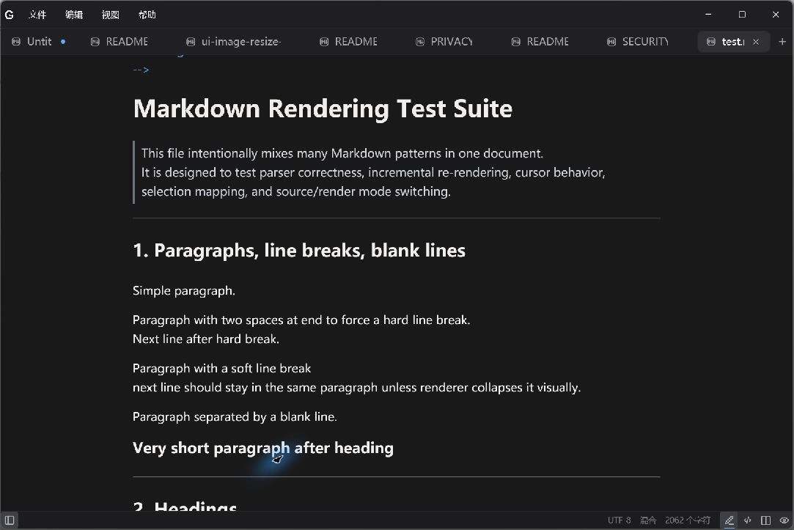
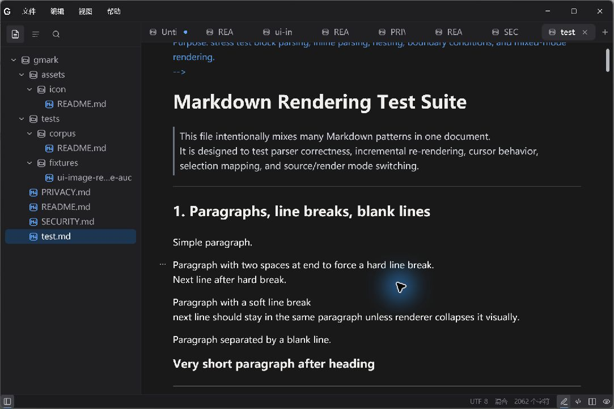
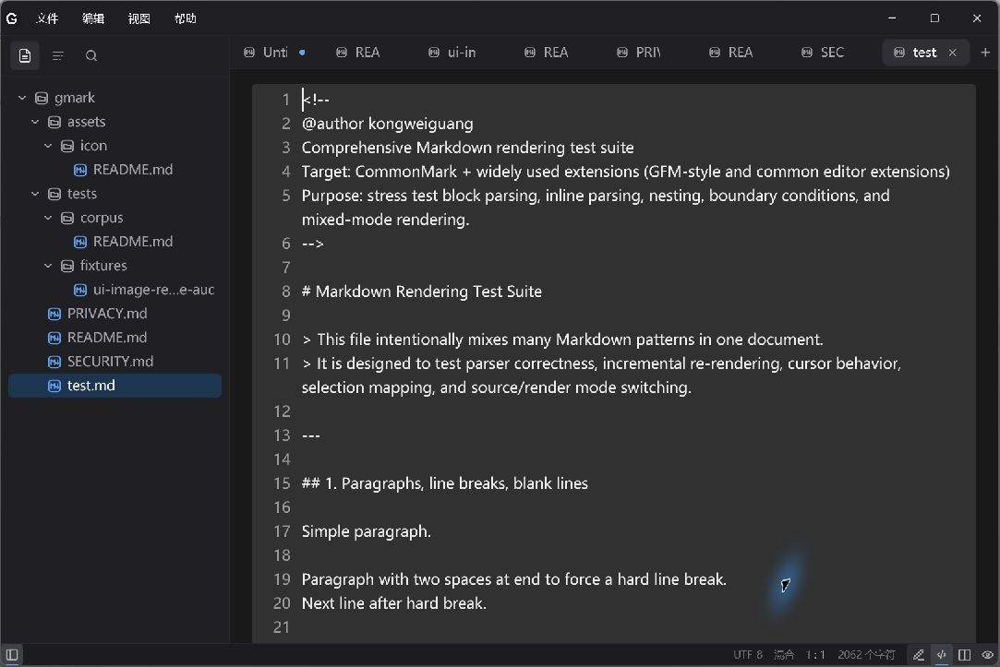

<!-- @author kongweiguang -->

<div align="center">
  
  <h1>gmark</h1>
  <p><strong>专注写作，也能从容打开大文件的本地 Markdown 编辑器。</strong></p>
  <p>
    <a href="https://github.com/kongweiguang/gmark/releases">下载最新版</a>
    ·
    <a href="#快速开始">快速开始</a>
    ·
    <a href="#主要功能">主要功能</a>
    ·
    <a href="https://github.com/kongweiguang/gmark/issues">问题反馈</a>
  </p>
</div>



gmark 是一款使用 Rust 与 GPUI 构建的本地优先 Markdown 编辑器。它把 Live 可视化编辑、带行号的 Source、左右对照的 Split 和只读 Preview 放进同一个克制的桌面工作区；从一篇临时笔记到一个文档文件夹，都可以使用普通文本文件完成。

gmark 不要求注册账号。文档仍然是你磁盘上的普通文件，适合个人笔记、技术文档、项目 README 和需要长期保存的纯文本资料。

当前版本：**v0.1.1**

## 你可以用 gmark 做什么

- 在 Live、Source、Split 和 Preview 四种视图之间直接切换。
- 使用标签页同时处理多篇文档，并恢复上次的窗口与工作区状态。
- 打开文件夹，通过文件列表、大纲、工作区搜索和快速打开浏览文档。
- 编写标题、列表、任务、表格、代码块、引用、链接、图片、脚注、数学公式和 Mermaid 图表。
- 使用查找替换、命令面板、专注模式和打字机模式完成长文写作。
- 将文档导出为 HTML、PNG 图片或 PDF。
- 打开 Markdown、纯文本、JSON、JSONL、CSV 和 TSV；大文件会进入按需读取的专用模式。
- 自定义主题、字体、版心、行高、自动保存、英文拼写检查和快捷键。

## 安装

前往 [GitHub Releases](https://github.com/kongweiguang/gmark/releases) 下载适合当前系统的安装包。

| 平台 | 安装包 |
| --- | --- |
| Windows x64 | Setup EXE |
| Linux x64 | AppImage、Deb |
| macOS Apple Silicon | DMG |
| macOS Intel | DMG |

macOS 安装包目前未使用 Apple Developer ID 签名和公证。如果将 gmark 拖入“应用程序”后仍被 Gatekeeper 阻止，请先确认安装包来自本仓库的 GitHub Releases，再在终端中运行：

```bash
sudo xattr -rd com.apple.quarantine /Applications/gmark.app
```

该命令只移除 gmark 的隔离标记，不会全局关闭 Gatekeeper。

## 快速开始

### 1. 新建或打开文档

启动 gmark 后可以直接开始写作，也可以从“文件”菜单打开已有文档。将 Markdown 文件交给 gmark 打开时，应用会保留文件原本的内容与路径。

### 2. 打开一个工作区

选择“打开文件夹”后，侧栏会显示文件、当前文档大纲和工作区搜索。你可以在工作区内新建、重命名或移动文件与文件夹；移动 Markdown 文件时，gmark 会先展示影响范围，并更新受影响文档中的相对链接。



### 3. 选择编辑方式

窗口右下角的四个模式按钮可以随时切换当前文档的呈现方式：

| 模式 | 适合场景 |
| --- | --- |
| Live | 直接编辑渲染后的标题、列表、表格、Callout 和其它内容块。 |
| Source | 在带行号的文本编辑器中精确控制完整 Markdown。 |
| Split | 左侧编辑源码，右侧查看同步的只读渲染结果。 |
| Preview | 隐藏编辑状态，以只读方式阅读或展示文档。 |



### 4. 保存或导出

使用保存、另存为或可选的延时自动保存写回普通文件。需要分享成品时，可从“导出”菜单生成 HTML、PNG 或 PDF。

## 界面导览

| 区域 | 用途 |
| --- | --- |
| 顶部菜单 | 文件、编辑、视图和帮助保留高频命令；左上角 gmark 菜单提供偏好设置、更新和应用信息。 |
| 工作区侧栏 | 在文件、大纲和搜索之间切换；可以收起、调整宽度或放在窗口另一侧。 |
| 标签栏 | 在多个文档之间切换、固定标签页或恢复最近关闭的标签页。 |
| 编辑区 | 根据当前模式显示 Live 内容块、Source、Split 或 Preview；大文件使用按需加载的源码界面。 |
| 状态栏 | 左侧控制工作区，右侧显示编码、换行符、光标位置和字数，并提供四种模式的快捷入口。 |

界面支持浅色、深色和跟随系统主题。正文字体、字号、行高、内容宽度、侧栏位置以及状态栏项目都可以在偏好设置中调整。

## 主要功能

### Markdown 写作

- Live 可视化编辑、Source 源码编辑、Split 左右对照和 Preview 只读阅读。
- 标题、段落、粗体、斜体、删除线、下划线、行内代码和链接。
- 有序列表、无序列表、任务列表、引用、Callout、脚注和分隔线。
- 原生表格编辑、代码高亮、图片、数学公式、Mermaid 和安全的 HTML 子集。
- 复制为 Markdown、粘贴为纯文本，以及可配置的图片粘贴位置。

### 工作区与导航

- 文件夹工作区、文档大纲和跨文件内容搜索。
- 快速打开、命令面板、跳转到行、文档内查找与替换。
- 多窗口、多标签、固定标签和恢复关闭的标签页。
- 工作区内新建、移动、重命名与撤销文件操作。
- 移动文件前检查变更，并同步维护 Markdown 相对链接。

### 文档引擎与结构化文本

gmark 会在完整读取前有界探测格式、编码、体积、行数和结构复杂度。普通文件按格式提供 Markdown、JSON、JSONL 或 CSV/TSV 的专属视图；任一安全阈值越界后统一进入按可见区域读取的 Paged Source，不再启动全文结构投影。

- 支持 Markdown、纯文本、JSON、JSONL/NDJSON、CSV 和 TSV/TAB。
- 大文件源码按可见区域读取，并支持搜索、定位、编辑、撤销与保存。
- 标准 JSON 支持可交互图预览、源码定位、节点详情和实时左右分栏；右下角 Live 按钮进入全屏可编辑 Graph，Preview 与 Split 中也可双击字段，或使用左下角“实时图编辑”入口，把标量字段及对象/数组子树校验后反向写回同一份源码。单次图内编辑上限为 256 KiB，超限会转到 Source；单次投影最多加载 1,500 个图项目，超限后可搜索、折叠或聚焦局部子树。
- JSONL/NDJSON 继续使用源码与结构视图；CSV/TSV 的 Live 可编辑单元格和增删行列，Split 同步显示源码与只读表格，Preview 提供筛选和虚拟化表格；Markdown 可查看表格投影。
- 保存时检查文件是否已被其它程序修改，降低意外覆盖风险。

实现边界保持分离：`gmark-document-core` 提供后端无关的打开策略、事务、快照和视图契约；`gmark-document` 提供 Resident Rope；`gmark-paged-document` 提供 Paged PieceDocument；`gmark-document-runtime` 统一两个后端的会话状态；`gmark-json-graph` 直接消费通用不可变快照，不依赖 GPUI 或具体存储引擎。详细边界见 `docs/document-architecture.md`。

### 专注与个性化

- 专注模式减少界面干扰，打字机模式让当前输入区域保持在视野中央。
- 浅色、深色、跟随系统以及本地自定义主题。
- 字体、字号、行高、内容宽度、侧栏位置和状态栏项目设置。
- 延时自动保存、英文拼写检查、括号与 Markdown 标记自动配对。
- 可修改的键盘快捷键，并在偏好设置中检测快捷键冲突。
- 中文与英文界面，并支持本地语言包。

### 导出与恢复

- 导出完整 HTML、PNG 图片和 PDF。
- 保存窗口、工作区、标签页、光标与视图状态，便于下次继续。
- 为未保存内容维护本地恢复数据，异常退出后可以恢复编辑进度。
- 自动更新只接受签名清单，并在安装前校验下载文件。

## 数据与隐私

- 文档、设置、工作区状态和恢复数据默认保存在本机。
- 使用 gmark 不需要账号，也不需要把文档上传到云端。
- 打开和保存始终围绕普通文件进行，你可以继续使用 Git、同步盘或自己的备份方案。
- 联网能力主要用于检查更新及加载文档主动引用的网络资源。

重要文档仍建议纳入版本控制或定期备份；恢复功能用于处理意外退出，不应替代长期备份。

## 常见问题

### gmark 会把 Markdown 转成专有格式吗？

不会。保存后的内容仍是普通 Markdown 文本，可以继续被其它编辑器、Git 和静态站点工具读取。

### Live 视图会不会丢失我写的源码？

不会。Live、Source、Split 和 Preview 使用同一份 Markdown 文本作为文档真值。对于不能直接可视化编辑的内容，gmark 会保留原始源码；涉及复杂或工具专用语法时，可以切换到 Source 或 Split 确认结果。

### 为什么某些文件打开后界面不同？

普通非 Markdown 文本默认使用 Source。标准 `.json` 默认显示本地生成的图预览；CSV、TSV 和 TAB 默认显示只读表格 Preview，并可从右下角切换到可编辑 Live、原始 Source 或左右 Split。Live 的修改先作为可撤销源码事务保存在内存中，只有保存命令才写回磁盘。

### PDF 导出失败怎么办？

PDF 导出需要系统中可用的 Chrome、Chromium、Edge 或其它兼容 Chromium 浏览器。安装后重新启动 gmark，再尝试导出。

### 如何反馈问题或建议？

请在 [GitHub Issues](https://github.com/kongweiguang/gmark/issues) 提交问题，并附上操作系统、gmark 版本、复现步骤和可公开的示例文档。请不要上传包含隐私或机密信息的原始文件。

## 从源码构建

准备 Rust 1.95.0 和当前平台的 GPUI 构建依赖后运行：

```text
cargo build --release --locked
```

生成的可执行文件位于 `target/release`。完整的质量检查、平台依赖和打包命令以仓库中的 CI 与 `docs/` 文档为准。

## 开源协议

gmark 以 GNU General Public License v3.0 or later（GPL-3.0-or-later）授权。

本项目参考了 Velotype 和 Zed 的代码。
