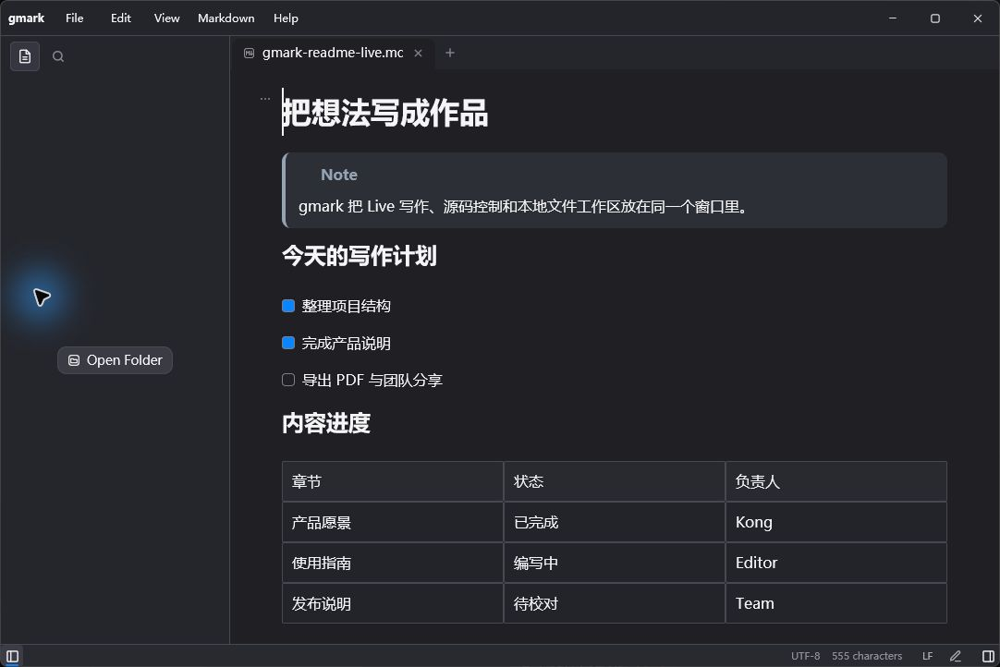
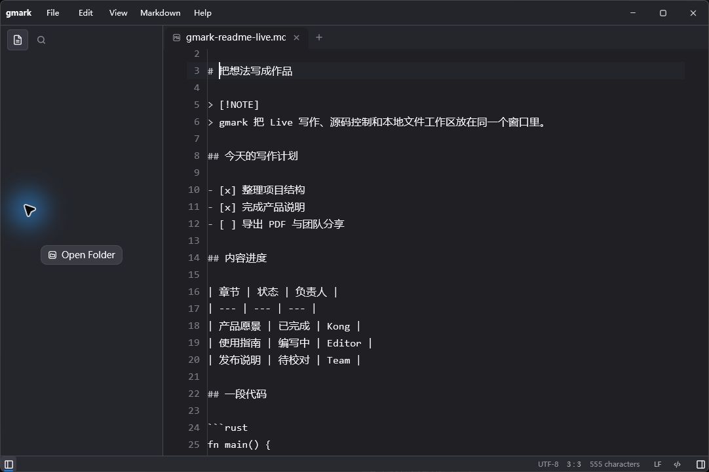
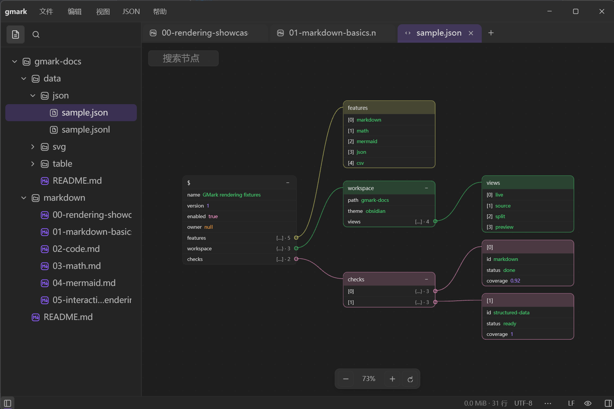

<!-- @author kongweiguang -->

<div align="center">
  
  <h1>gmark</h1>
  <p><strong>本地优先的 Markdown 与结构化文本编辑器。</strong></p>
  <p>专注写作，也能从容处理代码、数据和大文件。</p>
  <p>
    <a href="https://github.com/kongweiguang/gmark/releases">下载最新版</a>
    ·
    <a href="#快速开始">快速开始</a>
    ·
    <a href="#功能全景">功能全景</a>
    ·
    <a href="https://github.com/kongweiguang/gmark/issues">问题反馈</a>
  </p>
</div>



gmark 使用 Rust 与 GPUI 构建。文档始终是磁盘上的普通文件，不需要账号，也不会为了编辑而上传内容。你可以用它写一篇临时笔记、维护整个文档工作区，也可以直接查看 JSON、JSONL、CSV、TSV 和超大文本文件。

当前版本：**v0.1.4**

## 为什么选择 gmark

- **同一份 Markdown，四种视图**：Live、Source、Split 和 Preview 随时切换。
- **真正的本地文件工作区**：多标签、文件树、全文搜索、快速打开和文档导航集中在一个窗口。
- **不只编辑 Markdown**：JSON 提供交互式 Graph，CSV/TSV 提供可编辑表格，JSONL 和代码文件保留精确源码体验。
- **为大文件准备**：超过阈值后自动使用 Paged Source，只读取当前可见区域附近的内容。
- **可恢复、可检查**：自动保存可选，保存前检查外部修改，异常退出后保留恢复数据。

## 四种编辑视图

| 视图 | 使用场景 |
| --- | --- |
| **Live** | 直接编辑渲染后的标题、列表、任务、表格、Callout 等内容块。 |
| **Source** | 使用带行号、语法高亮和结构折叠的源码编辑器精确控制文本。 |
| **Split** | 左侧编辑源码，右侧同步查看只读渲染或结构化结果。 |
| **Preview** | 隐藏编辑状态，专注阅读、检查和展示。 |



Live 与 Source 不维护两份内容。四种视图共享同一份文档真值，切换视图不会把 Markdown 转成专有格式；无法直接可视化编辑的语法也会保留在源码中。

## 功能全景

### Markdown 写作

- 标题、段落、粗体、斜体、删除线、下划线、上标、下标、行内代码和链接。
- 有序列表、无序列表、任务列表、引用、Callout、脚注、分隔线和注释。
- 原生表格编辑、代码高亮、图片、数学公式、Mermaid 和安全的 HTML 子集。
- 斜杠菜单、选区工具栏、右键菜单、复制为 Markdown 和粘贴为纯文本。
- 查找替换、跳转到行、拼写检查、括号与 Markdown 标记自动配对。
- 专注模式与打字机模式，适合长文写作。

### 工作区与导航

- 左侧文件/搜索工作区与右侧文档导航可以独立收起和调整宽度。
- Markdown 显示大纲，JSON/JSONL 显示结构，CSV/TSV 显示列，其它文本显示文档信息。
- 多窗口、多标签、固定标签、恢复最近关闭标签和上次会话。
- 快速打开、命令面板、跨文件内容搜索和文档内查找替换。
- 在工作区中新建任意扩展名文件，打开、定位、复制路径、刷新、移动、重命名、移到回收站或撤销文件操作。
- 移动 Markdown 文件前预览影响范围，并同步更新受影响文档的相对链接。

### JSON、JSONL 与表格

标准 JSON 默认提供本地生成的交互式 Graph，可搜索、缩放、折叠、聚焦子树并定位源码。Live Graph 支持直接修改标量、对象和数组，校验后再写回同一份源码；Split 可以同时查看源码与结构。



- JSONL/NDJSON 提供源码与记录结构视图。
- CSV、TSV 和 TAB 在 Live 中可编辑单元格、增删行列，在 Preview 中提供筛选与虚拟化表格。
- Markdown 表格可以投影为表格视图。
- 图内单次编辑上限为 256 KiB；单次 Graph 投影最多加载 1,500 个项目，超限时可搜索、折叠或聚焦局部子树。

### 源码、大文件与格式化

gmark 会先进行有界探测，再决定使用完整 Resident 文档还是 Paged Source。大文件模式按可见区域读取，仍支持搜索、定位、编辑、撤销和保存，不会为了生成完整预览而一次性加载全文。

Source 会按语言显示结构折叠 gutter。严格 JSON 和 JSONL 使用内置格式化器；Rust、JavaScript/TypeScript、Python、Go、TOML、C/C++、Shell 等语言可以调用已安装的 `rustfmt`、`prettier`、`black`、`gofmt`、`taplo`、`clang-format` 或 `shfmt`。

默认格式化快捷键为 `Shift+Alt+F`。保存时格式化默认关闭，可以在偏好设置、用户 `config.toml` 或工作区 `.gmark.toml` 中配置。工作区配置中的自定义命令会在本机执行，因此只应对可信工作区启用。

### 图片、附件与视频

图片使用标准 Markdown 图片语法。附件和视频使用普通链接的 title 标记，在 Live 中显示为资源卡片：

```markdown
[需求文档](./note.assets/spec.pdf "gmark:resource")
[演示视频](./note.assets/demo.mp4 "gmark:resource;type=video")
```

资源可以通过文件选择器、拖放、单路径粘贴、斜杠菜单或命令面板插入。远程资源不会被自动下载；`javascript:`、`data:` 和 `blob:` 等危险协议只保留源码并显示为不支持。

### 导出、恢复与更新

- 将 Markdown 导出为完整 HTML、PNG 图片或 PDF。
- HTML 导出会复制可用的本地资源到同名 `.assets` 目录；远程 URL 不会被下载。
- 保存窗口、工作区、标签、光标和视图状态，重新启动后继续工作。
- 为未保存内容维护本地恢复数据，并在异常退出后提供恢复。
- 自动更新只接受签名清单，并在安装前校验下载文件。

PDF 导出需要系统中存在 Chrome、Chromium、Edge 或其它兼容 Chromium 浏览器。

### 外观与偏好设置

- 深色、浅色和跟随系统三种外观。
- Xcode、Fleet、Obsidian 与 Claude 四套内置配色，均提供深色和浅色版本。
- 正文字体、字号、行高、内容宽度和状态栏项目。
- 延时自动保存、英文拼写检查和图片/资源插入位置。
- 可修改的键盘快捷键，并自动检测快捷键冲突。
- 中文与英文界面，支持本地语言包。

## 安装

前往 [GitHub Releases](https://github.com/kongweiguang/gmark/releases) 下载对应平台的安装包。

| 平台 | 安装包 |
| --- | --- |
| Windows x64 | Setup EXE |
| Linux x64 | AppImage、Deb |
| macOS Apple Silicon | DMG |
| macOS Intel | DMG |

macOS 安装包目前未使用 Apple Developer ID 签名和公证。如果确认安装包来自本仓库的 GitHub Releases，但拖入“应用程序”后仍被 Gatekeeper 阻止，可以运行：

```bash
sudo xattr -rd com.apple.quarantine /Applications/gmark.app
```

该命令只移除 gmark 的隔离标记，不会全局关闭 Gatekeeper。

## 快速开始

1. 启动 gmark，直接新建文档，或从“文件”菜单打开文件/文件夹。
2. 打开文件夹后，使用左侧文件树浏览工作区，使用右侧导航查看当前文档结构。
3. 从窗口右下角切换 Live、Source、Split 或 Preview。
4. 使用保存、另存为或可选的延时自动保存写回普通文件。
5. 需要分享时，从当前文档菜单导出 HTML、PNG 或 PDF。

常用快捷键：

| 操作 | Windows / Linux | macOS |
| --- | --- | --- |
| 保存 | `Ctrl+S` | `Cmd+S` |
| 打开文件 | `Ctrl+O` | `Cmd+O` |
| 打开文件夹 | `Ctrl+Shift+O` | `Cmd+Shift+O` |
| 快速打开 | `Ctrl+P` | `Cmd+P` |
| 命令面板 | `Ctrl+Shift+P` | `Cmd+Shift+P` |
| 查找 | `Ctrl+F` | `Cmd+F` |
| 跳转到行 | `Ctrl+G` | `Ctrl+G` |
| 切换视图 | `Ctrl+Tab` | `Cmd+Tab` |
| 格式化文档 | `Shift+Alt+F` | `Shift+Alt+F` |

所有快捷键都可以在偏好设置中修改。

## 支持的文件

| 类型 | 默认体验 |
| --- | --- |
| Markdown | Live / Source / Split / Preview，完整写作与导出能力 |
| JSON | 交互式 Graph、Live 编辑、源码和分栏 |
| JSONL / NDJSON | 源码、记录结构与导航 |
| CSV / TSV / TAB | 可编辑表格、筛选预览和源码分栏 |
| 纯文本与代码 | Source、语法高亮、折叠与外部格式化器 |
| 超过阈值的文件 | Paged Source，按可见区域读取 |

如需绕过格式探测并以最保守方式打开内容，可以使用“安全源码打开”。

## 数据与隐私

- 文档、设置、工作区状态和恢复数据默认保存在本机。
- 使用 gmark 不需要账号，也不需要把文档上传到云端。
- 你仍然可以使用 Git、同步盘或自己的备份方案管理普通文件。
- 联网主要用于检查更新，以及在用户确认后打开文档主动引用的网络链接。
- 恢复功能用于处理意外退出，不替代版本控制和长期备份。

## 从源码构建

准备 Rust 1.95.0 和当前平台的 GPUI 构建依赖，然后运行：

```text
cargo build --release --locked
```

生成的可执行文件位于 `target/release`。完整质量检查、平台依赖和打包流程以仓库中的 CI 与 `docs/` 文档为准。

## 反馈与协议

问题与建议请提交到 [GitHub Issues](https://github.com/kongweiguang/gmark/issues)，并附上操作系统、gmark 版本、复现步骤和可公开的示例文档。请勿上传包含隐私或机密信息的原始文件。

gmark 以 GNU General Public License v3.0 or later（GPL-3.0-or-later）授权。

本项目参考了 Velotype 的代码。
