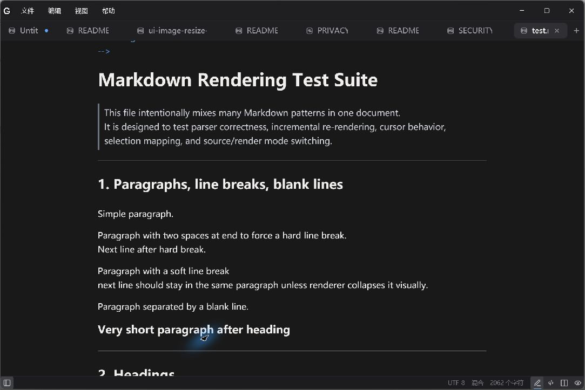
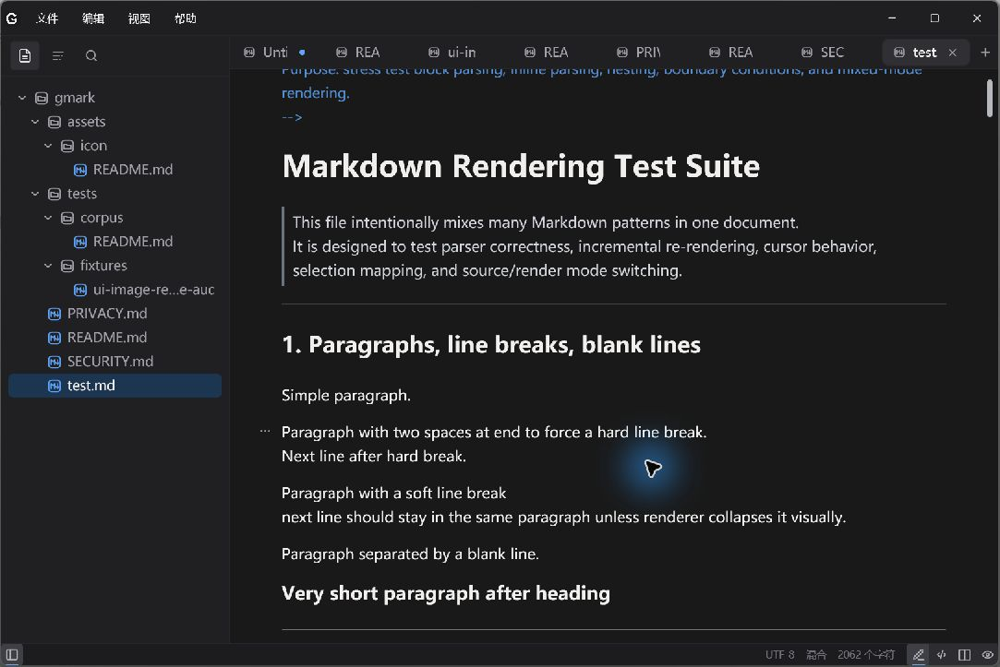
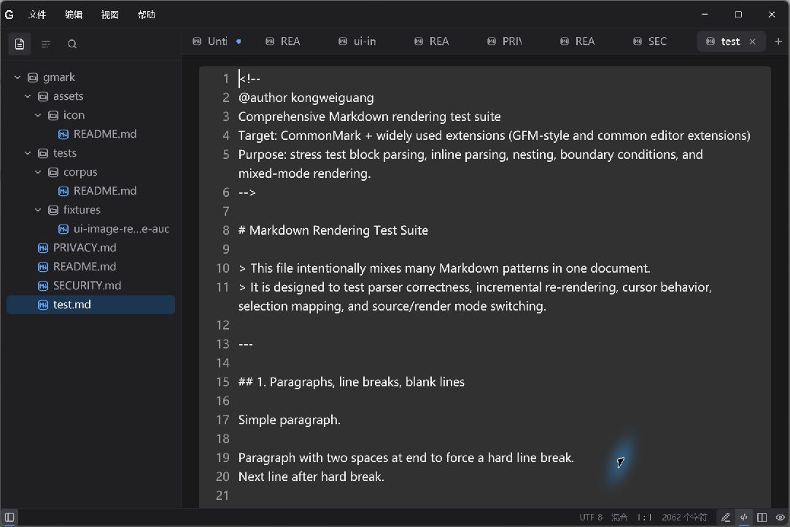

<!-- @author kongweiguang -->

<div align="center">
  
  <h1>gmark</h1>
  <p><strong>专注写作，也能从容打开大文件的本地 Markdown 编辑器。</strong></p>
  <p>
    <a href="https://github.com/kongweiguang/gmark/releases">下载最新版</a>
    ·
    <a href="#快速开始">快速开始</a>
    ·
    <a href="#主要功能">主要功能</a>
    ·
    <a href="https://github.com/kongweiguang/gmark/issues">问题反馈</a>
  </p>
</div>



gmark 是一款使用 Rust 与 GPUI 构建的本地优先 Markdown 编辑器。它把 Live 可视化编辑、带行号的 Source、左右对照的 Split 和只读 Preview 放进同一个克制的桌面工作区；从一篇临时笔记到一个文档文件夹，都可以使用普通文本文件完成。

gmark 不要求注册账号。文档仍然是你磁盘上的普通文件，适合个人笔记、技术文档、项目 README 和需要长期保存的纯文本资料。

当前版本：**v0.1.2**

## 你可以用 gmark 做什么

- 在 Live、Source、Split 和 Preview 四种视图之间直接切换。
- 使用标签页同时处理多篇文档，并恢复上次的窗口与工作区状态。
- 打开文件夹，通过左侧文件/搜索工作区、右侧文档导航和快速打开浏览文档。
- 编写标题、列表、任务、表格、代码块、引用、链接、图片、脚注、数学公式和 Mermaid 图表。
- 使用查找替换、命令面板、专注模式和打字机模式完成长文写作。
- 将文档导出为 HTML、PNG 图片或 PDF。
- 打开 Markdown、纯文本、JSON、JSONL、CSV 和 TSV；大文件会进入按需读取的专用模式。
- Xcode 与 JetBrains 两套配色，支持深色、浅色和跟随系统；字体、版心、行高、自动保存、英文拼写检查和快捷键。

## 安装

前往 [GitHub Releases](https://github.com/kongweiguang/gmark/releases) 下载适合当前系统的安装包。

| 平台 | 安装包 |
| --- | --- |
| Windows x64 | Setup EXE |
| Linux x64 | AppImage、Deb |
| macOS Apple Silicon | DMG |
| macOS Intel | DMG |

macOS 安装包目前未使用 Apple Developer ID 签名和公证。如果将 gmark 拖入“应用程序”后仍被 Gatekeeper 阻止，请先确认安装包来自本仓库的 GitHub Releases，再在终端中运行：

```bash
sudo xattr -rd com.apple.quarantine /Applications/gmark.app
```

该命令只移除 gmark 的隔离标记，不会全局关闭 Gatekeeper。

## 快速开始

### 1. 新建或打开文档

启动 gmark 后可以直接开始写作，也可以从“文件”菜单打开已有文档。将 Markdown 文件交给 gmark 打开时，应用会保留文件原本的内容与路径。

### 2. 打开一个工作区

选择“打开文件夹”后，固定在左侧的工作区会显示文件和搜索。右侧的“文档导航”默认收起：Markdown 显示当前文档大纲，JSON/JSONL 显示结构，CSV/TSV 显示列；纯文本、Paged Source 或无法建立索引的文档会显示格式、大小、行数、编码和换行符信息。你可以在工作区内用任意扩展名新建文件，也可以重命名或移动文件与文件夹；新建的代码和纯文本会直接在 Source 标签页打开。移动 Markdown 文件时，gmark 会先展示影响范围，并更新受影响文档中的相对链接。



### 3. 选择编辑方式

窗口右下角的四个模式按钮可以随时切换当前文档的呈现方式：

| 模式 | 适合场景 |
| --- | --- |
| Live | 直接编辑渲染后的标题、列表、表格、Callout 和其它内容块。 |
| Source | 在带行号的文本编辑器中精确控制完整 Markdown。 |
| Split | 左侧编辑源码，右侧查看同步的只读渲染结果。 |
| Preview | 隐藏编辑状态，以只读方式阅读或展示文档。 |



### 4. 保存或导出

使用保存、另存为或可选的延时自动保存写回普通文件。需要分享成品时，可从“导出”菜单生成 HTML、PNG 或 PDF。

## 界面导览

| 区域 | 用途 |
| --- | --- |
| 顶部菜单 | 文件、编辑、视图和帮助保留高频命令；视图与帮助之间会按当前标签显示 Markdown、JSON、JSONL、CSV、TSV 或文本菜单，提供大纲/结构/记录/表格工具、筛选、文档信息和选区导出；Markdown 另提供 HTML、PNG、PDF 导出，左上角 gmark 菜单提供偏好设置、更新和应用信息。 |
| 左工作区 | 固定在左侧，在文件和搜索之间切换；可以收起并调整宽度。 |
| 文档导航 | 固定在右侧，默认收起；按当前格式显示大纲、结构、列或文档信息，可收起并独立调整宽度。 |
| 标签栏 | 在多个文档之间切换、固定标签页或恢复最近关闭的标签页。 |
| 编辑区 | 根据当前模式显示 Live 内容块、Source、Split 或 Preview；大文件使用按需加载的源码界面。 |
| 状态栏 | 左端控制工作区，右端显示编码、换行符、光标位置和字数，并提供四种模式与文档导航入口。 |

界面支持深色、浅色和跟随系统三种外观，并可分别选择 Xcode 或 JetBrains 配色。正文字体、字号、行高、内容宽度以及状态栏项目都可以在偏好设置中调整。宽屏下两栏停靠在编辑器两侧；窄窗口会将它们变为可同时打开的左右覆盖层。

## 主要功能

### Markdown 写作

- Live 可视化编辑、Source 源码编辑、Split 左右对照和 Preview 只读阅读。
- 标题、段落、粗体、斜体、删除线、下划线、上标、下标、行内代码和链接。
- 有序列表、无序列表、任务列表、引用、Callout、脚注、分隔线和注释。
- 原生表格编辑、代码高亮、图片、数学公式、Mermaid 和安全的 HTML 子集。
- 复制为 Markdown、粘贴为纯文本，以及可配置的图片粘贴位置。

### 资源卡片

附件和视频使用标准 Markdown 链接的 title 标记：

```markdown
[需求文档](./note.assets/spec.pdf "gmark:resource")
[演示视频](./note.assets/demo.mp4 "gmark:resource;type=video")
```

独占段落中的资源链接在 Resident Markdown Live 中显示为稳定的文件卡片；图片仍使用标准 `` 原位显示。资源可以是本地文件或 HTTPS/其它合法系统协议，gmark 不会自动下载远程内容；`javascript:`, `data:` 和 `blob:` 等危险协议会保留源码并显示为不支持状态。Paged 大文件保持 Source，不探测文件也不渲染卡片。

资源命令可从斜杠菜单、Markdown 顶部菜单、编辑器右键菜单和命令面板进入，并支持文件选择器、文件拖放和单路径粘贴。图片、附件和视频共用“资源”插入策略，但图片仍生成标准图片语法；已有用户的 `image_paste_behavior` 会迁移到 `resource_insert_behavior`，兼容版本保存期间会双写两个键。

### 工作区与导航

- 固定双侧栏工作区、Markdown 文档大纲、结构/列导航和跨文件内容搜索。
- 快速打开、命令面板、跳转到行、文档内查找与替换。
- 多窗口、多标签、固定标签和恢复关闭的标签页。
- 工作区内新建任意扩展名文件，以及移动、重命名与撤销文件操作。
- 移动文件前检查变更，并同步维护 Markdown 相对链接。

### 文档引擎与结构化文本

gmark 会在完整读取前有界探测格式、编码和文件体积。普通文件按格式提供 Markdown、JSON、JSONL 或 CSV/TSV 的专属视图；只有文件体积超过配置阈值时才进入按可见区域读取的 Paged Source，不再启动全文结构投影。

- 支持 Markdown、纯文本、JSON、JSONL/NDJSON、CSV 和 TSV/TAB。
- 大文件源码按可见区域读取，并支持搜索、定位、编辑、撤销与保存。
- 标准 JSON 支持可交互图预览、源码定位、节点详情和实时左右分栏；右下角 Live 按钮进入全屏可编辑 Graph，Preview 与 Split 中也可双击字段，或使用左下角“实时图编辑”入口，把标量字段及对象/数组子树校验后反向写回同一份源码。单次图内编辑上限为 256 KiB，超限会转到 Source；单次投影最多加载 1,500 个图项目，超限后可搜索、折叠或聚焦局部子树。
- JSONL/NDJSON 继续使用源码与结构视图；CSV/TSV 的 Live 可编辑单元格和增删行列，Split 同步显示源码与只读表格，Preview 提供筛选和虚拟化表格；Markdown 可查看表格投影。
- 保存时检查文件是否已被其它程序修改，降低意外覆盖风险。

#### 源码折叠与格式化

Source 视图会按文件语言显示结构折叠 gutter。Resident 文档在后台解析完整源码；Paged 大文件只解析当前窗口前后各 2,048 行、单窗口最多 4 MiB，并禁用会产生全文改写的格式化。搜索、转到行和结构导航命中隐藏行时会自动展开必要的父级，复制与导出仍使用真实源码范围。

严格 JSON 和 JSONL 使用内置、保持 token 词法的格式化器；Rust、JavaScript/TypeScript、Python、Go、TOML、C 系等语言会使用已安装的 `rustfmt`、`prettier`、`black`、`gofmt`、`taplo`、`clang-format` 或 `shfmt`。格式化文档默认快捷键为 `Shift+Alt+F`，保存时格式化默认关闭，可在偏好设置中开启。

用户 `config.toml` 或工作区根目录的 `.gmark.toml` 可以覆盖 formatter：

```toml
[formatting]
format_on_save = false
timeout_ms = 15000
max_output_mib = 64

[formatting.languages.rust]
command_windows = "rustfmt --emit stdout"
command_unix = "rustfmt --emit stdout"
supports_range = false
```

自定义 formatter 从 stdin 读取源码、把替换文本写到 stdout，并可读取 `GMARK_FILE`、`GMARK_LANGUAGE`、`GMARK_RANGE_START` 与 `GMARK_RANGE_END`。工作区 `.gmark.toml` 中的命令会覆盖用户配置并直接通过 PowerShell 或 `/bin/sh` 执行，不显示信任确认；只应打开和格式化可信工作区，提交仓库配置前也应像审查构建脚本一样审查这些命令。

实现边界保持分离：`gmark-document-core` 提供后端无关的打开策略、事务、快照和视图契约；`gmark-document` 提供 Resident Rope；`gmark-paged-document` 提供 Paged PieceDocument；`gmark-document-runtime` 统一两个后端的会话状态；`gmark-json-graph` 直接消费通用不可变快照，不依赖 GPUI 或具体存储引擎。

### 专注与个性化

- 专注模式减少界面干扰，打字机模式让当前输入区域保持在视野中央。
- 深色、浅色、跟随系统，以及 Xcode / JetBrains 两套内置配色。
- 字体、字号、行高、内容宽度和状态栏项目设置。
- 延时自动保存、英文拼写检查、括号与 Markdown 标记自动配对。
- 可修改的键盘快捷键，并在偏好设置中检测快捷键冲突。
- 中文与英文界面，并支持本地语言包。

### 导出与恢复

- 导出完整 HTML、PNG 图片和 PDF。
- 保存窗口、工作区、标签页、光标与视图状态，便于下次继续。
- 为未保存内容维护本地恢复数据，异常退出后可以恢复编辑进度。
- 自动更新只接受签名清单，并在安装前校验下载文件。

## 数据与隐私

- 文档、设置、工作区状态和恢复数据默认保存在本机。
- 使用 gmark 不需要账号，也不需要把文档上传到云端。
- 打开和保存始终围绕普通文件进行，你可以继续使用 Git、同步盘或自己的备份方案。
- 联网能力主要用于检查更新及在用户确认后打开文档主动引用的网络链接；资源卡片不会自动下载远程内容。

HTML 导出会把可用的本地资源复制到与 HTML 同名的 `.assets` 目录，并使用相对链接；URL 不下载。复制或导出失败、取消时不会发布半成品 HTML，也不会删除导出前已经存在的资源。PNG/PDF 只绘制静态资源卡片，不嵌入播放器或显示完整本地绝对路径。

重要文档仍建议纳入版本控制或定期备份；恢复功能用于处理意外退出，不应替代长期备份。

## 常见问题

### gmark 会把 Markdown 转成专有格式吗？

不会。保存后的内容仍是普通 Markdown 文本，可以继续被其它编辑器、Git 和静态站点工具读取。

### Live 视图会不会丢失我写的源码？

不会。Live、Source、Split 和 Preview 使用同一份 Markdown 文本作为文档真值。对于不能直接可视化编辑的内容，gmark 会保留原始源码；涉及复杂或工具专用语法时，可以切换到 Source 或 Split 确认结果。

### 为什么某些文件打开后界面不同？

普通非 Markdown 文本默认使用 Source。标准 `.json` 默认显示本地生成的图预览；CSV、TSV 和 TAB 默认显示只读表格 Preview，并可从右下角切换到可编辑 Live、原始 Source 或左右 Split。Live 的修改先作为可撤销源码事务保存在内存中，只有保存命令才写回磁盘。

### PDF 导出失败怎么办？

PDF 导出需要系统中可用的 Chrome、Chromium、Edge 或其它兼容 Chromium 浏览器。安装后重新启动 gmark，再尝试导出。

### 如何反馈问题或建议？

请在 [GitHub Issues](https://github.com/kongweiguang/gmark/issues) 提交问题，并附上操作系统、gmark 版本、复现步骤和可公开的示例文档。请不要上传包含隐私或机密信息的原始文件。

## 从源码构建

准备 Rust 1.95.0 和当前平台的 GPUI 构建依赖后运行：

```text
cargo build --release --locked
```

生成的可执行文件位于 `target/release`。完整的质量检查、平台依赖和打包命令以仓库中的 CI 与 `docs/` 文档为准。

## 开源协议

gmark 以 GNU General Public License v3.0 or later（GPL-3.0-or-later）授权。

本项目参考了 Velotype 的代码。
