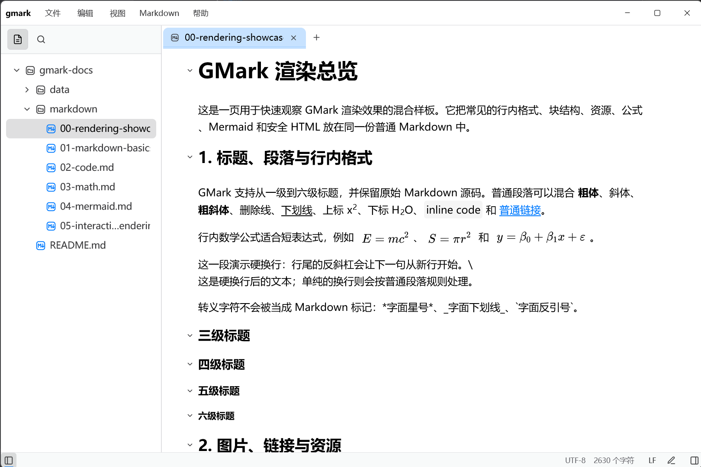
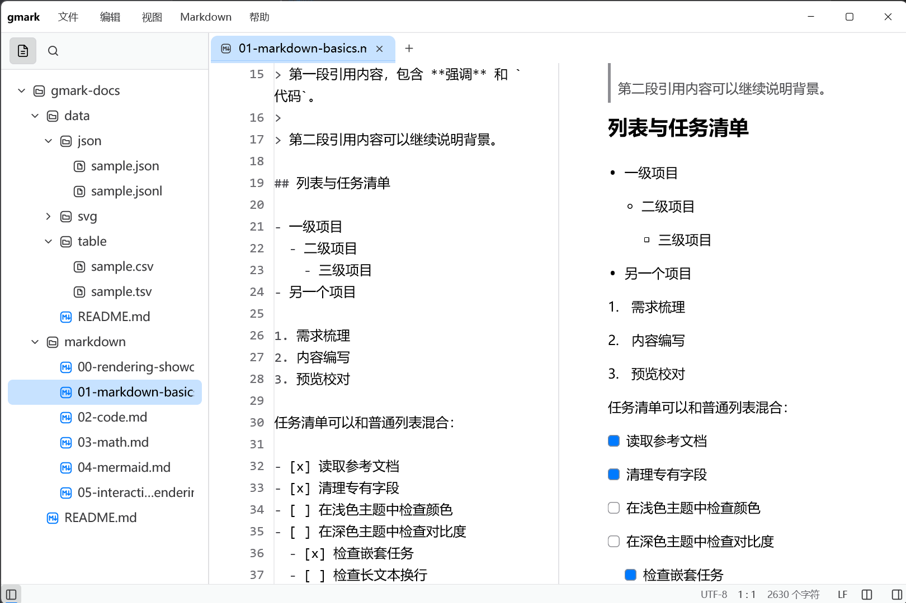
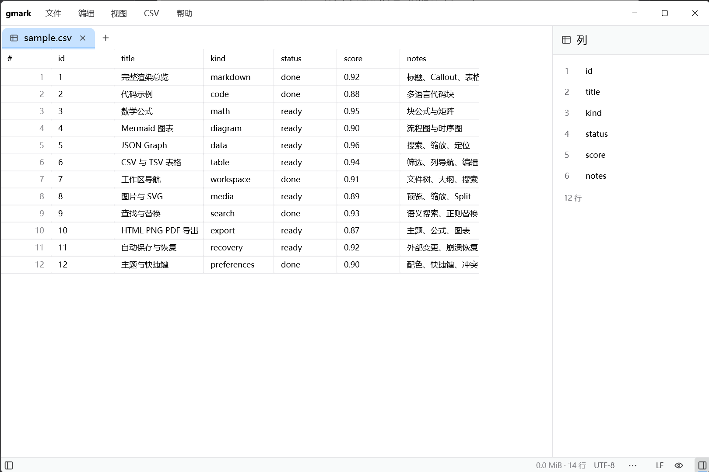

<!-- @author kongweiguang -->

<div align="center">
  
  <h1>Gmark</h1>
  <p><strong>把 Markdown 写作、源码控制与结构化数据浏览放进同一个本地工作台。</strong></p>
  <p>Live 负责流畅编辑，Source 保留精确控制；JSON Graph 和 CSV/TSV 表格让数据文件也能直接读、查、改。</p>
  <p>
    <a href="https://github.com/kongweiguang/gmark/releases">下载</a>
    ·
    <a href="#快速开始">快速开始</a>
    ·
    <a href="gmark-docs/README.md">功能示例</a>
    ·
    <a href="https://github.com/kongweiguang/gmark/issues">问题反馈</a>
  </p>
</div>

<div align="center">
  <picture>
    <source media="(prefers-color-scheme: dark)" srcset="assets/screenshots/gmark-hero-dark.png" />
    <source media="(prefers-color-scheme: light)" srcset="assets/screenshots/gmark-hero-light.png" />
    
  </picture>
</div>

Gmark 使用 Rust 与 GPUI 构建。文档始终是磁盘上的普通文件：不需要账号，不会为了编辑而上传内容，也不会把 Markdown 转换成专有格式。当前版本为 **v0.2.0**。

## 一份文件，四种视图

| 视图 | 用途 |
| --- | --- |
| **Live** | 直接编辑渲染后的标题、列表、任务、表格、Callout、公式等内容块。 |
| **Source** | 使用带行号、语法高亮和结构折叠的源码编辑器精确控制文本。 |
| **Split** | 同时查看源码与渲染结果，适合校对语法和复杂内容。 |
| **Preview** | 隐藏编辑状态，专注阅读、检查与展示。 |

四种视图共享同一份文档真值。下面的真实界面打开了 [`gmark-docs/markdown/01-markdown-basics.md`](gmark-docs/markdown/01-markdown-basics.md)，源码中的嵌套列表和任务状态会直接映射到右侧结果。

<p align="center">
  
</p>

Markdown 当前支持：

- 标题、段落、粗体、斜体、删除线、下划线、上标、下标、行内代码、链接和图片。
- 有序/无序/任务列表、引用、GFM Callout、脚注、定义列表、分隔线和注释。
- 原生表格、代码块与语法高亮、行内/块数学公式、Mermaid、安全 HTML 子集和本地资源卡片。
- 选区格式工具栏、块操作区、右键菜单、斜杠菜单、命令面板以及复制为 Markdown。
- 查找替换、跳转到行、拼写检查、标记与括号自动配对、标题/Callout 折叠、专注和打字机模式。

## 结构化数据，直接看清

### JSON Graph

标准 JSON 默认可以显示本地生成的交互式 Graph。可以搜索节点、缩放画布、折叠分支、聚焦子树、查看 JSONPath，并跳转到对应源码；通过校验的编辑会写回同一份 JSON 文本。

<p align="center">
  
</p>

### CSV 与 TSV

CSV、TSV 与 TAB 文件进入结构化表格，而不是被当成图片或普通 Markdown。表格支持单元格编辑、行列维护、筛选、列导航、源码/结构切换和大数据量虚拟化。下图直接打开了 [`gmark-docs/data/table/sample.csv`](gmark-docs/data/table/sample.csv)。

<p align="center">
  
</p>

JSONL/NDJSON 提供源码与逐条记录结构。JSON Graph 单次投影最多加载 1,500 个项目，图内单次编辑边界为 256 KiB；达到边界后仍可通过搜索、折叠或聚焦子树继续浏览。

## 当前能力

| 领域 | 已实现能力 |
| --- | --- |
| **Markdown 编辑** | Live / Source / Split / Preview、扩展 Markdown、表格、Callout、任务、脚注、安全 HTML、资源卡片。 |
| **代码与源码** | 行号、语言感知高亮、结构折叠、查找替换、行尾切换；严格 JSON/JSONL 内置格式化。 |
| **数学与图表** | LaTeX 源码输入、二维公式编辑、符号/结构面板；Mermaid Source / Preview / Split。 |
| **结构化数据** | JSON Graph、JSON/JSONL 结构导航、CSV/TSV 虚拟化表格、筛选、编辑和源码定位。 |
| **工作区** | 文件树、大纲、跨文件搜索、快速打开、命令面板、多标签、多窗口和会话恢复。 |
| **大文件** | 默认超过 16 MiB 自动进入 Paged Source，按可见区域读取并继续搜索、编辑和保存。 |
| **资源与预览** | PNG/JPEG/GIF/WebP/BMP 图片缩放预览；SVG Source / Preview / Split；拖放和资源插入。 |
| **导出** | Markdown 导出完整 HTML、PNG 或 PDF，并处理数学、Mermaid 与可用的本地资源。 |
| **保存与恢复** | 可选延时自动保存、外部修改检查、原子写回、异常退出恢复和冲突保护。 |
| **个性化** | 浅色/深色/跟随系统，Xcode/Fleet/Obsidian/Claude 配色，可配置快捷键和无障碍选项。 |

## 支持的文件

| 文件类型 | 默认体验 |
| --- | --- |
| Markdown | Live / Source / Split / Preview，完整写作、渲染与导出 |
| JSON | 交互式 Graph、结构编辑、Source 与 Split |
| JSONL / NDJSON | Source、逐条记录结构、搜索与导航 |
| CSV / TSV / TAB | 可编辑表格、筛选、列导航、Source 与结构视图 |
| SVG | 可编辑源码、实时预览与 Split |
| PNG / JPEG / GIF / WebP / BMP | 图片预览、缩放与适应宽度 |
| 纯文本与代码 | Source、行号、语法高亮、折叠与查找替换 |
| 超过 Resident 阈值的文本 | Paged Source，按可见区域读取 |

Source 内置语言识别覆盖 Rust、JavaScript/TypeScript、JSON/JSONL、Markdown、Bash、C/C++、C#、CSS、Go、HTML、Java、PHP、Python、Ruby、YAML、TOML、SQL、Lua、Swift、PowerShell、Dockerfile/Containerfile、Mermaid 等常见文本格式。

## 功能示例

[`gmark-docs/`](gmark-docs/README.md) 是随仓库维护的固定 Demo，截图也直接来自这里：

- [渲染总览](gmark-docs/markdown/00-rendering-showcase.md)：行内格式、块结构、资源、公式、Mermaid 与安全 HTML。
- [基础 Markdown](gmark-docs/markdown/01-markdown-basics.md)：段落、列表、任务、表格和链接。
- [代码示例](gmark-docs/markdown/02-code.md)：多语言代码块与语法高亮。
- [数学公式](gmark-docs/markdown/03-math.md)：行内公式、块公式、矩阵和结构编辑。
- [Mermaid 图表](gmark-docs/markdown/04-mermaid.md)：流程、时序、状态、类图等示例。
- [交互渲染](gmark-docs/markdown/05-interactive-rendering.md)：搜索、折叠和宽表等操作。
- [结构化数据](gmark-docs/data/README.md)：JSON、JSONL、CSV、TSV 与 SVG 样本。

## 快速开始

前往 [GitHub Releases](https://github.com/kongweiguang/gmark/releases) 下载对应平台的安装包。

| 平台 | 安装包 |
| --- | --- |
| Windows x64 | Setup EXE |
| Linux x64 | AppImage、Deb |
| macOS Apple Silicon | DMG |
| macOS Intel | DMG |

1. 启动 Gmark，直接新建文档，或从“文件”菜单打开文件/文件夹。
2. 打开文件夹后，使用左侧文件树浏览工作区，使用右侧导航查看当前文档结构。
3. 从窗口右下角切换 Live、Source、Split 或 Preview。
4. 保存后仍然得到普通文件；需要分享时可以导出 HTML、PNG 或 PDF。

常用快捷键：

| 操作 | Windows / Linux | macOS |
| --- | --- | --- |
| 保存 | `Ctrl+S` | `Cmd+S` |
| 打开文件 | `Ctrl+O` | `Cmd+O` |
| 打开文件夹 | `Ctrl+Shift+O` | `Cmd+Shift+O` |
| 快速打开 | `Ctrl+P` | `Cmd+P` |
| 命令面板 | `Ctrl+Shift+P` | `Cmd+Shift+P` |
| 查找 | `Ctrl+F` | `Cmd+F` |
| 切换视图 | `Ctrl+Tab` | `Cmd+Tab` |

快捷键可以在偏好设置中修改；冲突会在录制时直接提示。

<details>
<summary>macOS Gatekeeper 提示</summary>

当前安装包尚未使用 Apple Developer ID 签名和公证。如果确认安装包来自本仓库的 GitHub Releases，但拖入“应用程序”后仍被 Gatekeeper 阻止，可以运行：

```bash
sudo xattr -rd com.apple.quarantine /Applications/gmark.app
```

该命令只移除 Gmark 的隔离标记，不会全局关闭 Gatekeeper。

</details>

## 数据与隐私

- 文档、设置、工作区状态与恢复数据默认保存在本机。
- 使用 Gmark 不需要账号，也不需要把文档上传到云端。
- 文档中引用的 HTTP(S) 图片会在渲染时联网获取；请求不会携带 Cookie、Authorization 或 Referer，并受超时、重定向、并发和 20 MiB 响应上限保护。
- 其他网络链接由用户主动打开；危险 URL 协议只保留源码并显示为不支持。应用也可按偏好设置检查更新。
- 恢复功能用于处理意外退出，不替代版本控制和长期备份。

### 数据目录切换说明

v0.2.0 将配置、状态、缓存与运行时数据分别写入用户主目录下的 `~/.gmark/config`、`~/.gmark/state`、`~/.gmark/cache` 和 `~/.gmark/runtime`。旧平台配置目录中的偏好、自定义语言包、最近文件、窗口会话、恢复记录和安装 ID 不会自动迁移、扫描、修改或删除；需要保留偏好或语言包时，请在升级前手工复制到 `~/.gmark/config`。回滚旧二进制后，旧版本仍可读取原目录中的数据。

更新包与渲染索引会在新缓存目录按需重新生成。正式安装和应用内更新会先等待旧进程退出再启动新版本；手工同时启动新旧版本可能因两者使用不同的安装 ID 和单实例锁而成为两个独立实例。只支持 V2 capability 首跳确认的自动切换，更旧的 V1 更新事务需要手动运行安装器。

## 从源码构建

准备 Rust 1.95.0 和当前平台的 GPUI 构建依赖，然后运行：

```text
cargo build --release --locked
```

生成的可执行文件位于 `target/release`。命令行支持直接打开一个或多个文件，以及 `--help`、`--version` 和 `--detach`。完整质量检查、平台依赖和打包流程以仓库中的 CI 与 [`docs/`](docs/) 文档为准。

## 反馈与许可

问题与建议请提交到 [GitHub Issues](https://github.com/kongweiguang/gmark/issues)，并附上操作系统、Gmark 版本、复现步骤和可公开的示例文档。请勿上传包含隐私或机密信息的原始文件。

Gmark 以 GNU General Public License v3.0 or later（GPL-3.0-or-later）授权。

本项目参考了 Velotype 的部分实现。
