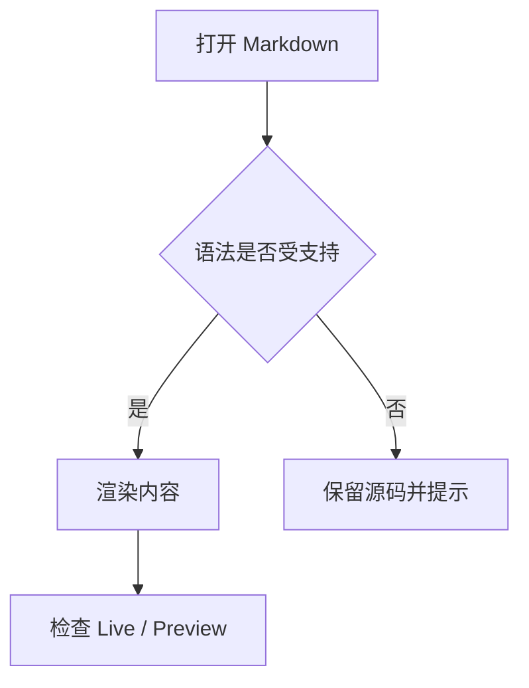

<!-- @author kongweiguang -->

# GMark 渲染总览

这是一页用于快速观察 GMark 渲染效果的混合样板。它把常见的行内格式、块结构、资源、公式、Mermaid 和安全 HTML 放在同一份普通 Markdown 中。

## 1. 标题、段落与行内格式

GMark 支持从一级到六级标题，并保留原始 Markdown 源码。普通段落可以混合 **粗体**、*斜体*、***粗斜体***、~~删除线~~、<u>下划线</u>、上标 x^2^、下标 H~2~O、`inline code` 和 [普通链接](https://example.com)。

行内数学公式适合短表达式，例如 $E = mc^2$、$S = \pi r^2$ 和 $y = \beta_0 + \beta_1x + \varepsilon$。

这一段演示硬换行：行尾的反斜杠会让下一句从新行开始。\
这是硬换行后的文本；单纯的换行则会按普通段落规则处理。

转义字符不会被当成 Markdown 标记：\*字面星号\*、\_字面下划线\_、\`字面反引号\`。

### 三级标题

#### 四级标题

##### 五级标题

###### 六级标题

## 2. 图片、链接与资源

标准 Markdown 图片使用本地相对路径：


链接可以带标题。GMark 资源卡片使用链接标题声明资源类型，例如下面的 JSON 文件仍然是普通文件引用：

[查看示例配置](../../assets/custom-language.example.jsonc "gmark:resource")

还可以使用自动链接：<https://github.com/kongweiguang/gmark> 和 <mailto:hello@example.com>。

## 3. 列表与任务

无序列表可以嵌套：

- 写作
  - 标题与段落
  - 链接与图片
- 计算
  - 行内公式
  - 块公式
- 图表
  - Mermaid 流程图
  - Mermaid 时序图

有序列表保留起始编号：

3. 先观察源码
4. 再切换到 Live 或 Preview
5. 最后检查导出结果

任务列表适合记录一个 Demo 的检查状态：

- [x] 标题和段落
- [x] 表格与任务列表
- [ ] 深色主题下检查公式
- [ ] 窄窗口下检查 Mermaid

## 4. 引用与 Callout

普通引用可以包含格式：

> 好的渲染样板既展示能力，也保留足够简单的源码。
>
> —— GMark 文档笔记

GMark 使用 GFM 风格的 Callout：

> [!NOTE]
> 这是一个 Note，适合补充背景信息。

> [!TIP]
> 这是一个 Tip，适合给出简短的操作建议。

> [!IMPORTANT]
> 这是一个 Important，适合标记必须注意的约束。

> [!WARNING]
> 这是一个 Warning，适合提示可能的风险。

> [!CAUTION]
> 这是一个 Caution，适合提醒谨慎操作。

## 5. 表格

表格支持对齐、行内格式和链接：

| 特性 | 示例 | 适用场景 |
| :--- | :---: | ---: |
| 文本 | **粗体** | 说明内容 |
| 代码 | `cargo test` | 命令与路径 |
| 链接 | [GMark](https://github.com/kongweiguang/gmark) | 相关项目 |
| 状态 | ✅ / ⏳ | 进度速查 |

## 6. 代码、公式与图表

```rust
fn render_status(name: &str, ready: bool) -> String {
    let status = if ready { "ready" } else { "pending" };
    format!("{name}: {status}")
}
```

块公式适合独立展示结论：

$$
\int_{0}^{1} x^2\,dx = \frac{1}{3}
$$



## 7. 脚注、HTML 与注释

脚注适合放置不打断正文的补充说明[^gmark]。同一个脚注可以在文档中重复引用[^gmark]。

<details>
<summary>点击查看安全 HTML 示例</summary>

<p><mark>mark</mark> 可以强调一小段文字，<kbd>Ctrl</kbd> + <kbd>S</kbd> 表示保存。</p>

<p><u>下划线</u>、<del>删除内容</del> 和 <small>辅助说明</small> 都属于受限的语义 HTML。</p>

</details>

<!-- 这条注释只存在于源码中，不应出现在渲染正文。 -->

[^gmark]: GMark 的脚注定义会保留在源文件中，并在渲染时与引用关联。

## 8. 混合内容检查清单

> [!IMPORTANT]
> 下面这段把多个元素放在一起，适合在不同主题和窗口宽度下观察：
>
> - **重点**：一段强调文本
> - `命令`：一段行内代码
> - [链接](https://example.com)：一个可点击链接
> - ~~旧内容~~：删除线
>
> | 项目 | 状态 |
> | --- | --- |
> | 公式 | $a^2 + b^2 = c^2$ |
> | 图表 | Mermaid |
>
结束后可以打开 [基础 Markdown 与组合排版](./01-markdown-basics.md) 继续查看更完整的块级组合。
