<!-- @author kongweiguang -->

# Mermaid 图表

Mermaid 图表使用 `mermaid` 代码块。下面的示例来自常见的流程、系统设计和知识整理场景，适合在 Gmark 中分别查看源码、预览和分屏效果。

## 流程图

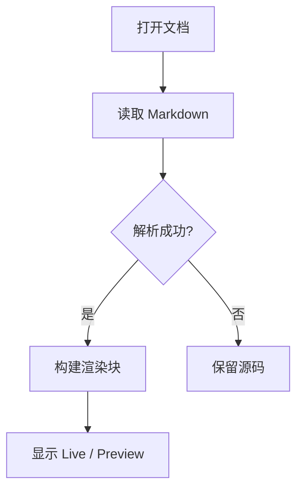

带分组的系统协作流程：

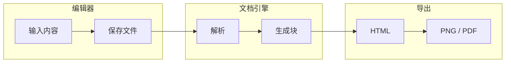

## 时序图

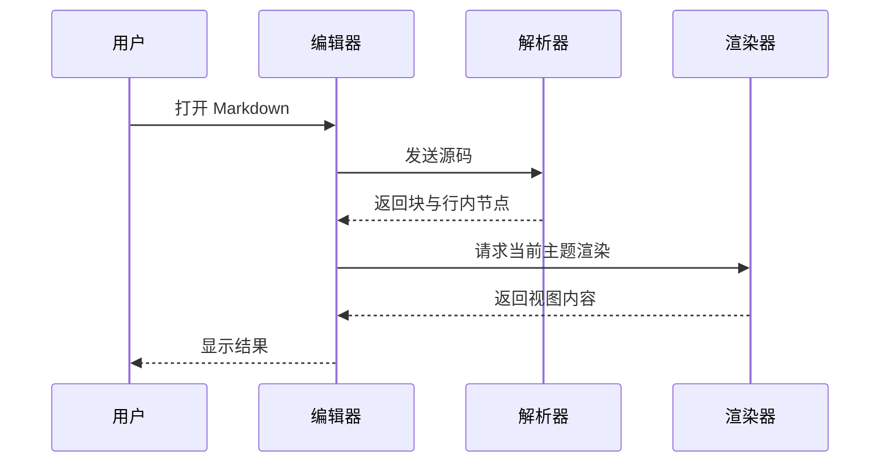

## 状态图

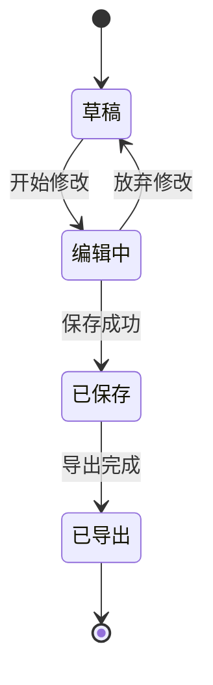

## 类图

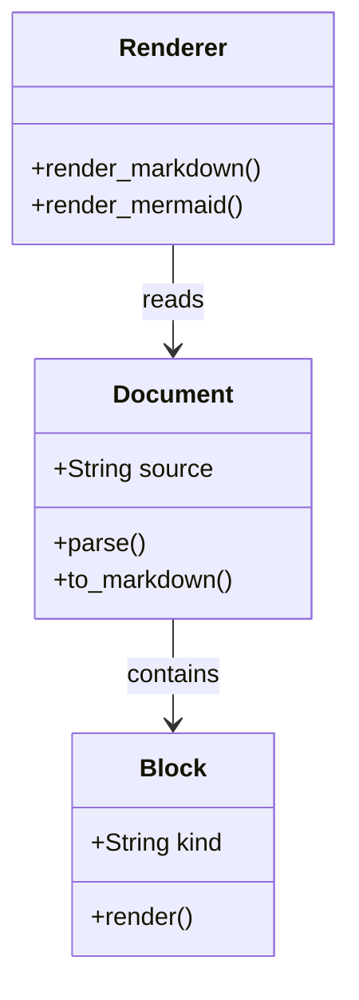

## ER 图

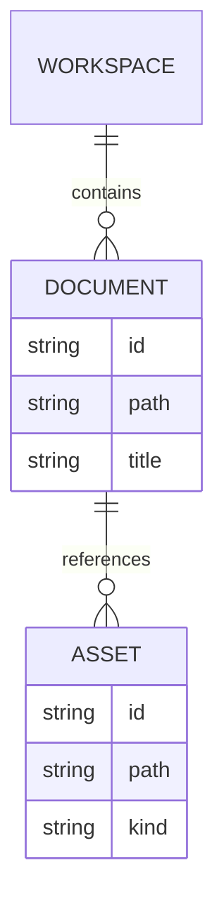

## 甘特图

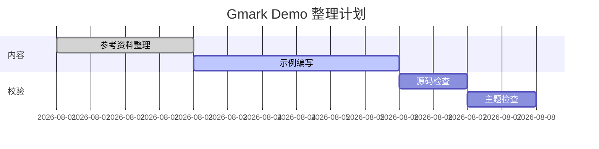

## 饼图

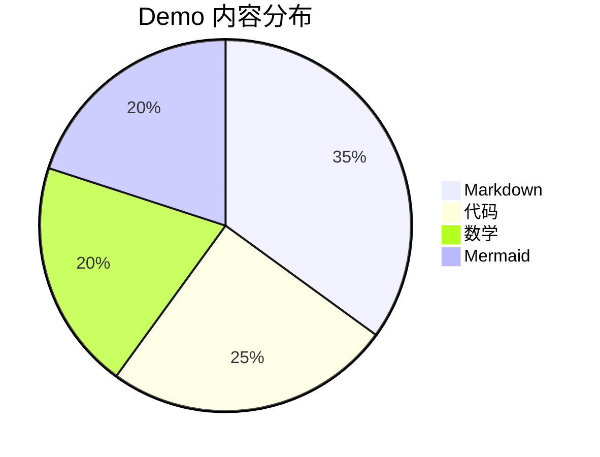

## Git 图

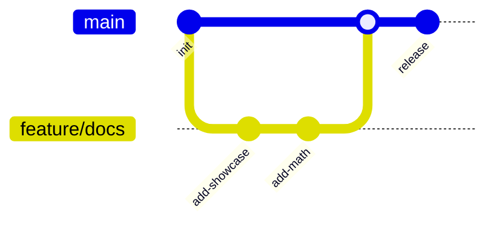

## Mindmap

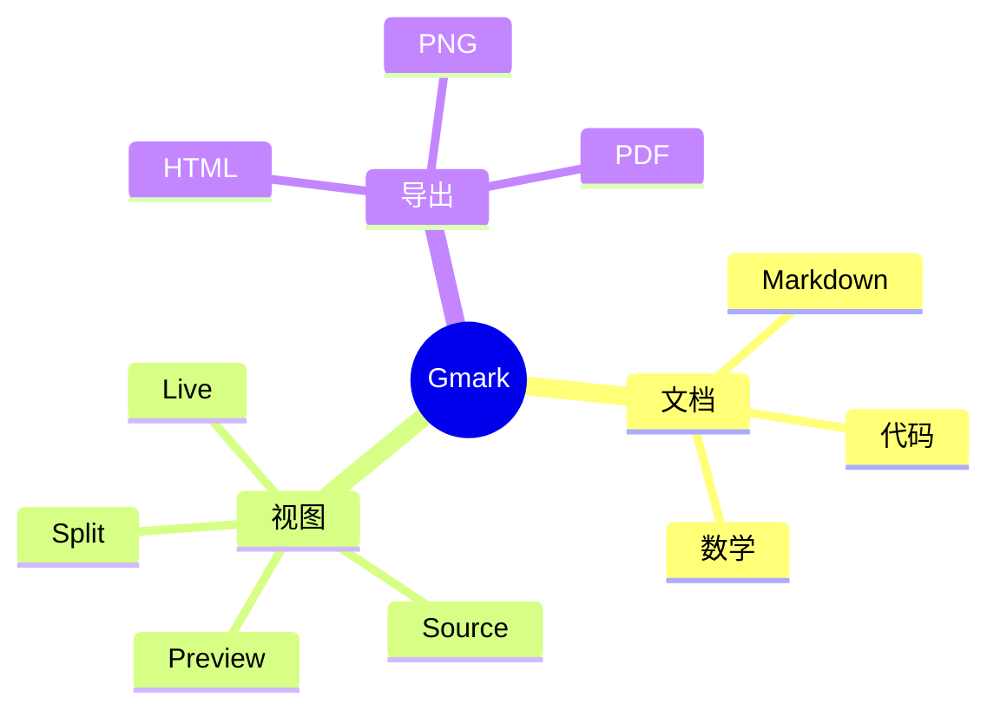

## 用户旅程图

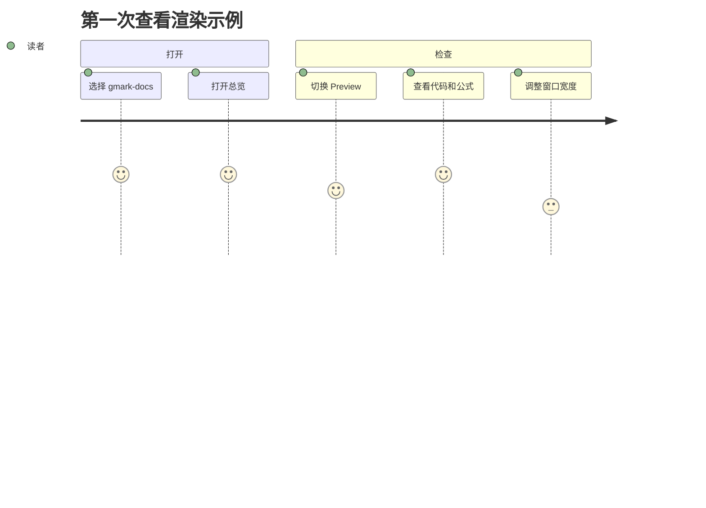

## 图表书写建议

- 一张图只表达一个主题，节点文字尽量短。
- 流程图优先使用 `TD` 或 `LR`，避免一次放入过多节点。
- 时序图把一次消息写成一个动作；复杂说明放在正文。
- Mermaid 出现错误时，先用最小图确认代码块标记和图表类型，再逐步增加内容。
